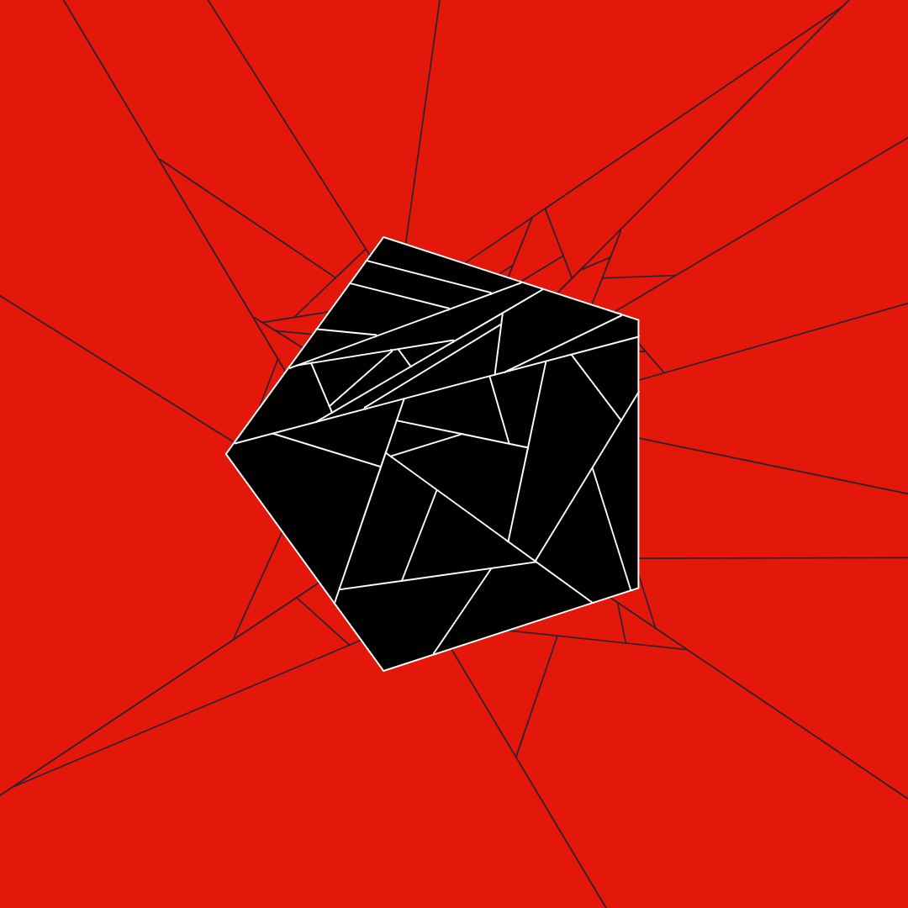
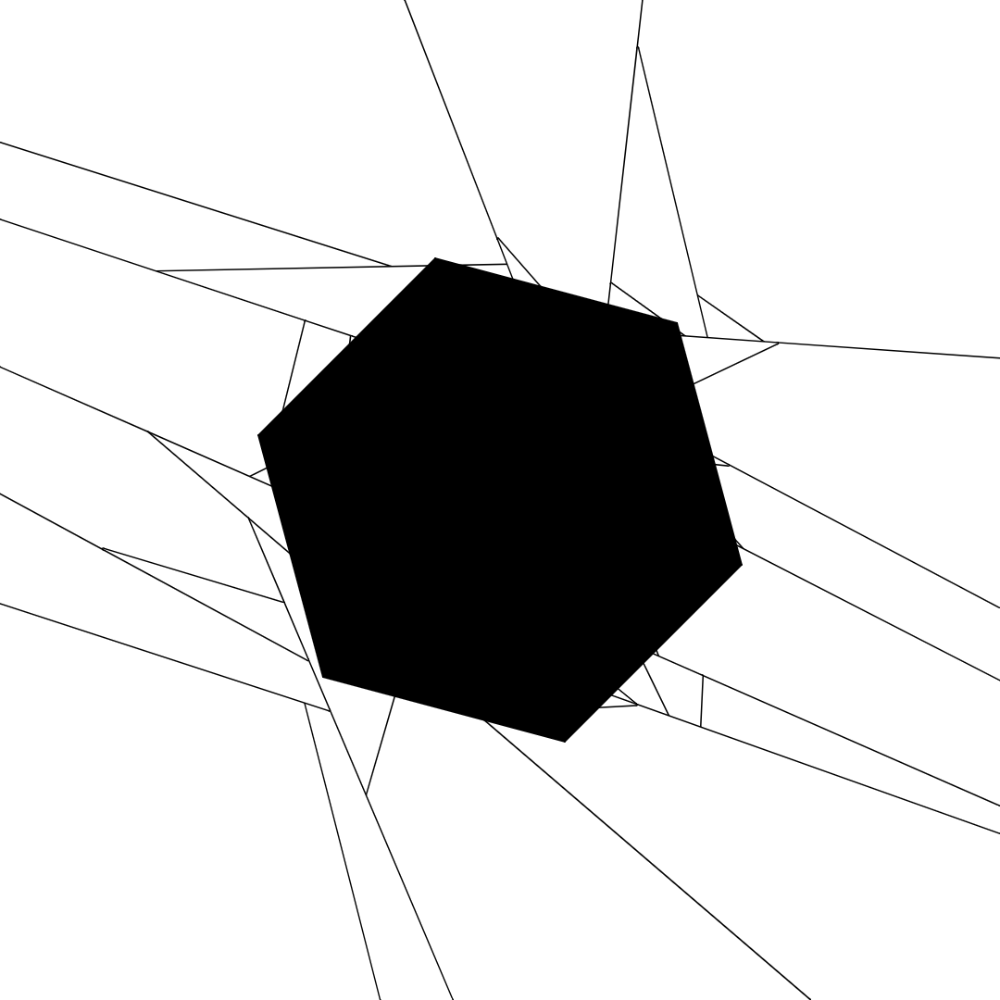
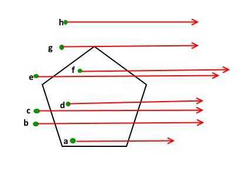

# Main

## Polytree Art ~~attempt?~~

Generative art algorithm based on quadtree generalization that breaks polygon apart as if cracks appeared on them.
 
 ### Results Examples:
 
 

 

---
# Polygon

## toHex
> takes a number and converts it into an hex number string

given a number and a number of digits, the method returns a string that represents the number in hexadecimal with the specified amount of digits.
 The string returned starts with a `#` symbol because this method was mainly used for colors
### Inputs
- number hex_number: number to convert;
 - ind digits: number of desired digits for the number: its default value is 8;

### Outputs
- string: hexadecimal number.
 

## class Point
> models a point

using cartesian coordinates, this class models a point in space
### Inputs
- number x: x coordinate;
 - number y: y coordinate.

 

## Point::distanceFrom
> computes the distance between two points

given a point, it returns the **squared** distance between this (Point) and other (Point)
### Inputs
- Point other: other point used to compute the distance;

### Outputs
- number: squared distance.
 

## Point::draw
> draws a point

draws the point as a circle of radius 5: this method was meant for debug purposes;
### Inputs
- number color: number that represents the color of the point;

### Outputs
- null.
 

## class Polygon
> used to model an n sided polygon

this class can be used to model any kind of polygon, it only needs the vertices (sorted by adjacency). Beware that a polygon **requires** at least 3 vertices.
### Inputs
- list<Points> vertices: used to define the polygon itself;
 - number fillColor: fill color of the shape;
 - number strokeColor: stroke color of the shape;

 

## Polygon::findEdges
> finds the edges of the polygon

using the vertices list, this method pairs a vertex with its successor to define the edges of the polygon.
### Inputs
- null;

### Outputs
- list<list<Points>>: list of pairs of edges.
 

## Polygon::draw

draws the polygon
### Inputs
- optional integer weight: weight of the stroke of the polygon shape;

### Outputs
- null.
 

## Polygon::contains
> returns whether the polygon contains a point

by casting a line from the point and counting the number of edges intersected, it is possible to understand if a point is inside a polygon.
     If the number of intersection is odd, in fact, it is quite obvious that the point is inside a polygon
     
### Inputs
- Point point: point used for the check;

### Outputs
- bool: whether the point is inside the polygon or not.
 

## Polygon::edgeContains

checks if a point is contained in an edge
### Inputs
- list<point> edge: edge to check;
     - Point point: point to check;

### Outputs
- bool: whether the point is contained in the edge or not.
 

## Polygon::intersects
> checks if a line intersects the edges of the polygon

given a point and an angle, the method checks if and where this lines intersects the edges of the polygon
### Inputs
- Point point: point within which the line passes;
     - number angle: angle of the line (radians);

### Outputs
- list<Point>: list of intersections **sorted by edges**: if an edge is not intersected "null" will be placed instead of a Point;
 
     For Example:
     [null, Point, null, Point] means that the line intersected the 2nd and 4th edge of the polygon.
 

## Polygon::split
> splits the polygon in two along a line

given a point and an angle that represent a line, the polygon will be split in two by the line if it intersects it.
     If by any chance the line is parallel to an edge and the point coincides with a vertex, the division is not possible
### Inputs
- Point point: point within which the line passes;
     - number angle: angle of the line (radians);

### Outputs
- list<Polygons>: the resulting polygons.
 

---
# Polytree

## class Polytree
> a quadtree generalization

using the same concept as the quad tree, the polytree generalizes it by expanding its properties to any polygon.
 The Polytree class is made of these fields:
 - Polygon bounds: polygon that defines the area covered by the polytree;
 - list<Point> data: list of points contained in the tree;
 - int capacity: max capacity of the data list, after reaching which the tree will be split;
 - bool divided: states if the tree was divided or not;
 - list<Polytree> children: polytrees resulting from the splitting procedure;
 - int length: number of elements in the data list;
### Inputs
- Polygon bounds: area covered by the polytree;
 - optional int capacity: capacity of the polytree, used to decide when to divide the tree.

 

## Polytree::draw
> draws the polytree and its children

if the tree is not divided, draws its polygon, otherwise it draws the polygons of its children
### Inputs
- optional number weight: stroke weight of the lines;
     - optional number multiplier: how much the weight of the lines changes between each "generation" of the trees (setting it to a value less than 1 will make the polygon lines thinner as divisions go on, if instead ist value is set to a number greater than 1 the lines will become thicker);

### Outputs
- null.
 

## Polytre::divide
> divides the polytree in two

when capacity is reached, the tree is divided in two children trees
### Inputs
- null;

### Outputs
- null.
 

---

generated with [EasyGen](http://easygen.altervista.org/) - [On Github](https://github.com/dede-amdp/easygen).